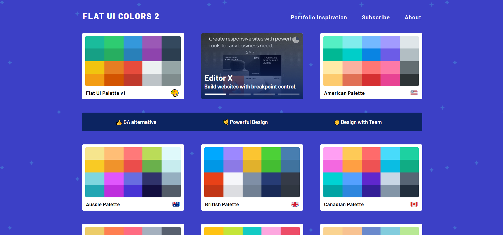
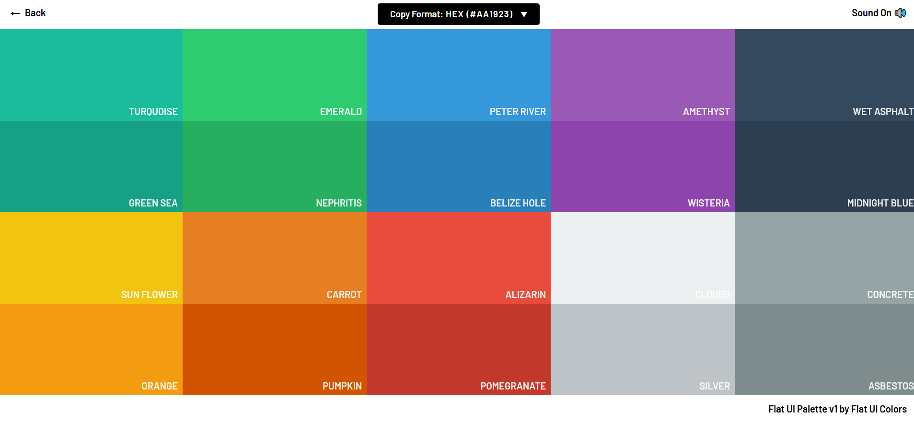

# Procesverslag
Markdown is een simpele manier om HTML te schrijven.  
Markdown cheat cheet: [Hulp bij het schrijven van Markdown](https://github.com/adam-p/markdown-here/wiki/Markdown-Cheatsheet).

Nb. De standaardstructuur en de spartaanse opmaak van de README.md zijn helemaal prima. Het gaat om de inhoud van je procesverslag. Besteedt de tijd voor pracht en praal aan je website.

Nb. Door *open* toe te voegen aan een *details* element kun je deze standaard open zetten. Fijn om dat steeds voor de relevante stuk(ken) te doen.

## Jij

uitwerken voor kick-off werkgroep

### Auteur:
Brent Duineveld

#### Je startniveau:
Blauw

#### Je focus:
Surface plane, al hoewel is mijn website volledig responsive.
 

## Je website

uitwerken voor kick-off werkgroep

### Je opdracht:
https://brentjeh.github.io/blokweb/

#### Screenshot(s) van de eerste pagina (small screen): 
Homepage  

#### Screenshot(s) van de tweede pagina (small screen):
Color Palette Page 

 

## Breakdownschets (week 1)

uitwerken na afloop 2e werkgroep

### de hele pagina: 

### dynamisch deel (bijv menu): 

### wellicht nog een dynamisch deel (bijv filter): 

## Voortgang 1 (week 2)

uitwerken voor 1e voortgang

### Stand van zaken
Ik was in de eerste week nog niet ver gekomen. Ik had al een idee welke website ik na wilde maken. Ik koos voor deze website omdat het veel verschillende inhoud had, en omdat ik wel van een uitdaging hou. Op de website kan je color palettes vinden, en de kleuren in deze color palettes kopieren en plakken. Ik had al een idee hoe ik dit met flexbox wilde aanpakken. Ik ging opzoek naar verschillende manieren hoe je dit anders dan met flexbox aan kon pakken, maar kwam tot de conclusie om het eerst maar met flexbox te proberen. Bovendien was ik lang bezig met het bedenken van manieren hoe ik het project aan ging pakken, terwijl ik ook gewoon kon beginnen met het schrijven van code en vanaf dan zien wat het meest toepasselijk is.

### Agenda voor meeting
samen met je groepje opstellen

| student 1      | student 2          | student 3    | student 4        |
| ---            | ---                | ---          | ---              |
| Hoe je een ca- | Hoe maak je een    | en ik dit    | en dan ik dat    |
| ousel maakt    | search bar         | nog een punt | dit wil ik zeker |
| ...            | ...                | ...          | ...              |

### Verslag van meeting
Ik had zelf geen vragen aangezien ik nog niet ver was met mijn website. Ik had overigens een paar lessen gemist omdat ik ziek was. Ik was wel bij het gesprek, om te kijken of anderen teamleden vragen hadden waarvan ik ook nog wat van op kon opsteken.

- punt 1: Ik vertelde dat ik nog niet ver was, en alleen een klein idee had van welke website ik wilde maken. Ik kreeg van Vasilis de feedback om wel snel te beginnen.

## Voortgang 2 (week 3)

uitwerken voor 2e voortgang

### Stand van zaken
Ik begon met het maken van mijn website. Ik had voor een groot deel al de HTML en CSS voor de homepage klaar. 

### Agenda voor meeting
samen met je groepje opstellen

| student 1      | student 2          | student 3    | student 4        |
| ---            | ---                | ---          | ---              |
| dit bespreken  | en dit             | en ik dit    | en dan ik dat    |
| en dat ook nog | dit als er tijd is | nog een punt | dit wil ik zeker |
| ...            | ...                | ...          | ...              |

### Verslag van meeting
hier na afloop snel de uitkomsten van de meeting vastleggen

- punt 1
- punt 2
- nog een punt
- ...

## Toegankelijkheidstest (week 4)

uitwerken na test in 8e voortgang

### Bevindingen
Lijst met je bevindingen die in de test naar voren kwamen:

#### Titel eerste bevinding
Hier korte omschrijving (met indien nodig een afbeelding)

Hier een omschrijving van hoe het opgelost kan worden (met indien nodig een afbeelding)

#### Titel tweede bevinding. 
Hier korte omschrijving (met indien nodig een afbeelding)

Hier een omschrijving van hoe het opgelost kan worden (met indien nodig een afbeelding)

#### Titel volgende bevinding. 
Hier korte omschrijving (met indien nodig een afbeelding)

Hier een omschrijving van hoe het opgelost kan worden (met indien nodig een afbeelding)

#### Titel nog een bevinding. 
Hier korte omschrijving (met indien nodig een afbeelding)

Hier een omschrijving van hoe het opgelost kan worden (met indien nodig een afbeelding)

## Voortgang 3 (week 4)

uitwerken voor 3e voortgang

### Stand van zaken
Wat minder goed ging was dat ik overnieuw moest beginnen met mijn code. Althans, moest niet, maar ik koos hier zelf voor omdat de code zo compliceert werd dat ik telkens tegen een nieuw probleem aan liep. Overigens was dat ook niet de bedoeling van de opdracht, de code moest mooi zijn. Responsiveness werkte door de over gecompliceerde code niet zoals ik wilde, veel objecten in mijn html begonnen over elkaar heen te lopen en de styling werkte niet zoals hoe ik het wilde. Op dit punt raadpleegde ik de studentassistenten, in de hoop ze een betere manier hadden van het maken van een responsive website. Een van de studentassistenten gaf me het advies om met CSS grid te werken. Ik was hier eerst best skeptisch over, aangezien ik nooit met grid had gewerkt, en bang was dat het leren van CSS grid veel extra tijd ging kosten waarvan ik al niet heel veel had. Uiteindelijk gaf ik het een kans en besloot me te verdiepen in grid, waardoor ik er vrij snel achterkwam dat de basis van grid niet heel moeilijk was, en dat het gebruiken van grid (voor mij) een stuk makkelijker was dan het gebruiken van flex box. Dankzij grid heb ik ook de hele website responsive kunnen maken. Verder heb ik van unsplash en van pixabay foto's en video's gehaald om als vervanging te gebruiken van de foto's die je op de site had.
 
Wat dus wel goed ging was het gebruiken van CSS grid. Grid maakte het voor mij erg makkelijk om de site volledig responsive te maken, zonder al te veel andere CSS elementen toe te voegen. Ook ging het overnieuw coderen van de website vrij makkelijk en liep tegen vrij weinig problemen aan.

### Agenda voor meeting
samen met je groepje opstellen

| student 1      | student 2          | student 3    | student 4        |
| ---            | ---                | ---          | ---              |
| dit bespreken  | en dit             | en ik dit    | en dan ik dat    |
| en dat ook nog | dit als er tijd is | nog een punt | dit wil ik zeker |
| ...            | ...                | ...          | ...              |

### Verslag van meeting
hier na afloop snel de uitkomsten van de meeting vastleggen

- punt 1
- punt 2
- nog een punt
- ...

## Eindgesprek (week 5)

uitwerken voor eindgesprek

### Stand van zaken
Wat minder goed ging is dat ik mijn tijd slecht gepland had. Uiteindelijk heb ik wel mijn website af kunnen maken en heb ik de surface plane kunnen uitbreiden. Er waren tijden tijdens het werken dat ik sneller dingen moest afraffelen, ook al waren er ook momenten waar ik rustig de tijd had om de website in elkaar te zetten. Ik heb een paar keer overnieuw moeten beginnen, wat het nog lastiger maakt, omdat ik in mijn eigen code verdwaald raakte. Ook pakte ik het responsive maken van de website niet goed aan, waardoor ik telkens tegen een nieuw probleem liep wanneer ik een ander probleem probeerde op te lossen.
 
Wat wel goed ging is dat de website natuurlijk af is. Ik heb veel geleerd, ik heb geleerd met grid te werken (wat ik persoonlijk toch fijner vind dan flexbox, omdat ik met flexbox telkens met de height van objecten aan het klooien was en met grid kon je een aspect ratio instellen, waardoor de height automatisch responsive was (het zou goed kunnen dat er ook een manier is om dit te doen met flexbox, zonder dat ik dit weet) maar toch vond ik het fijner om met grid te werken zodat je zelf ook het aantal columns en rows kon instellen). Ik heb vergeleken met voor dat ik met dit project begon veel nieuwe dingen geleerd, en heb het idee dat ik steeds dichterbij het coderen van een volledige en werkende website kom.

### Screenshot(s)

hier screenshot(s) van je eindresultaat
 

## Bronnenlijst

continu bijhouden terwijl je werkt

Nb. Wees specifiek ('css-tricks' als bron is bijv. niet specifiek genoeg).

Icoontjes	    https://ionic.io/ionicons/v4
Fotos		       https://unsplash.com/
Video 		      https://pixabay.com/videos/road-movement-sunset-sun-moscow-84970/
Hulp          https://stackoverflow.com/
              https://www.w3schools.com/
              Sasha Koning
              Zaid El Boustani

